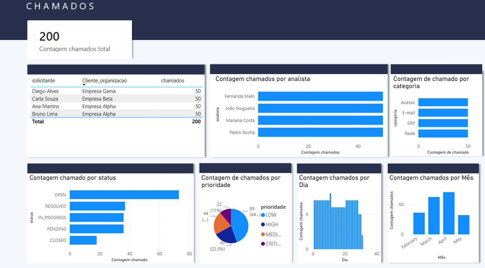
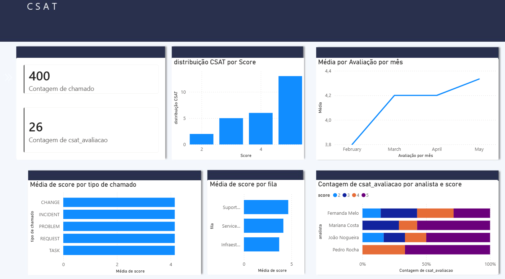

# TAPR-2026-1-ITSM

+ Integrantes: Guilherme T. Fiedler, Clara M. Martinovsky e Mario S.M. Junior

A **CorpTech Soluções em TI Ltda.** é uma empresa de médio porte prestadora de serviços de TI gerenciados, com **85 colaboradores** e uma carteira de **40 clientes corporativos ativos**.
A equipe interna de **service desk** conta com **12 analistas**, distribuídos em dois níveis de suporte (**N1 e N2**), responsáveis por atender um volume médio de **1.400 chamados por mês**.
Em **2023**, a CorpTech implantou o **Jira Service Management (JSM)** como ferramenta oficial de **ITSM**, substituindo o controle anterior feito em planilhas. A adoção foi bem-sucedida: todos os chamados passaram a ser **registrados, categorizados e resolvidos dentro da ferramenta**, que já está em operação estável há mais de um ano.

---

# Problema Identificado

Apesar de toda a operação de suporte estar registrada no **Jira Service Management**, a liderança de TI da CorpTech enfrenta dificuldades para **extrair inteligência desses dados de forma ágil**.
Os relatórios nativos do JSM são **limitados e estáticos**, exigindo que a gerente de TI, **Patrícia**, exporte manualmente os dados em **arquivos CSV todas as semanas** para montar relatórios e apresentá-los nas reuniões.
O JSM tem os dados. O problema é que eles estão presos dentro da ferramenta — sem integração, sem histórico externo e sem a flexibilidade analítica que a liderança precisa para tomar decisões de operação e capacidade.
As principais dificuldades identificadas são:

| Área | Dificuldade relatada |
|-----|-----|
| **Gestão de SLA** | Não há visão consolidada de cumprimento de SLA por categoria, analista e cliente. Violações são identificadas apenas após o fechamento do chamado. |
| **Backlog e filas** | A distribuição de chamados em aberto por analista e nível de suporte só é visível dentro do JSM, sem um painel externo consolidado. |
| **Tendências e volume** | Não existe análise histórica de volume de chamados por período, picos de abertura ou sazonalidade. Decisões de dimensionamento são baseadas em percepção. |
| **Performance da equipe** | Métricas como **MTTR (Tempo Médio de Resolução)** e **MTTA (Tempo Médio de Resposta)** por analista não são monitoradas de forma sistemática. |
| **Satisfação do cliente** | O **CSAT** coletado no JSM não é cruzado com tipo de chamado, cliente ou analista, dificultando identificar onde a satisfação está abaixo do esperado. |

---
# Dashboard

